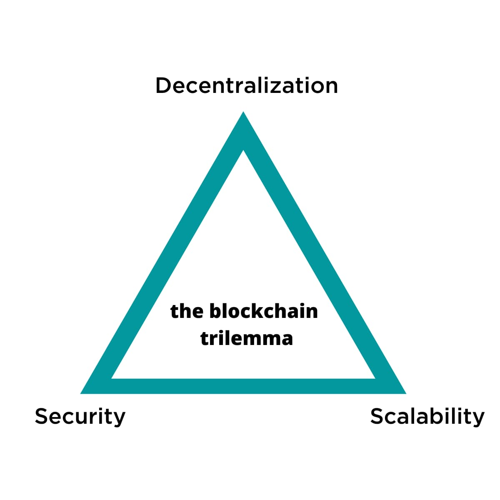
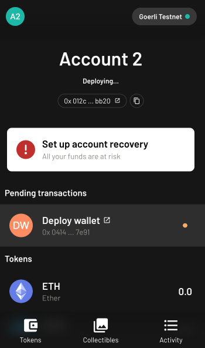

[StarkNet](https://starkware.co/starknet/) es una blockchain de propósito general cuyos smart contracts se escriben en el leguage de programación Cairo, y su red principal o mainnet ha estado activa desde diciembre de 2021. Es una de las soluciones L2 más populares en la actualidad y uno de los últimos protocolos disponibles en [Chainstack](https://chainscatck.com).

Durante los últimos meses, he estado leyendo artículos, tweets e incluso conocí a algunos miembros del equipo de StarkWare. El entusiasmo detrás de este proyecto es enorme, así que decidí investigar un poco y tratar de crear una app y un contrato que se ejecute en StarkNet.

Sin embargo, antes de eso, sabía que si quería entender por qué las soluciones de capa 2 (o layer 2) son tan populares, primero necesitaba saber el problema que resuelven y cómo lo hacen. Ahí es donde comenzó la odisea de StarkNet para mí 🚀 🪐

## Problemas de escalabilidad en Ethereum

Las blockchains son sistemas descentralizados. Eso significa que no confían en una sola entidad para validar las transacciones, esperan que todos procesen cada una de las transacciones del protocolo.

Esa es una de las razones por las que actualmente Ethereum no puede igualar el rendimiento en transacciones por segundo que pueden procesar los sistemas de la "vieja escuela" como Visa. En el trilema de blockchain, Ethereum optó por la descentralización y la seguridad sobre la escalabilidad.



Obviamente, estos **sistemas de la "vieja escuela" carecen de la descentralización de Ethereum.** Se basan en grandes centros de datos y bases de datos controlados por una sola entidad. Esta diferencia es lo que Henri Lieutaud, del equipo de StarkNet, definió como "contabilidad delegada" (bancos, Visa...) vs "contabilidad inclusiva" (blockchains).

Las cadenas de bloques que aparecieron años después de Ethereum, como Solana y BSC, abordaron este problema desde diferentes angulos:

- aumentar el tamaño de cada bloque, lo que significa que se pueden procesar más transacciones en cada bloque
- reducir la cantidad de validadores en la red.

Ambas cosas mejoran el rendimiento de los protocolos (y el TPS), pero al mismo tiempo reducen la descentralización.

## Soluciones de capa 2

Las cadenas de bloques de capa dos (o L2) intentan mejorar la escalabilidad en Ethereum al trasladar gran parte del trabajo pesado de las transacciones y la lógica de los contratos inteligentes fuera de la red principal de Ethereum, manteniendo la misma seguridad. Además de eso, las soluciones de capa dos prometen tarifas de gas más bajas, que es una de las cosas más importantes.

Pero, ¿cómo lo hacen? con Rollups. En pocas palabras, los rollups agrupan múltiples transacciones, las validan fuera de la red principal y envían solo el estado resultante a Ethereum. Hay dos tipos principales de rollups: optimistas (optimistic) y de conocimiento cero (zero-knowledge).

Como nos estamos enfocando en StarkNet, nos enfocaremos en las zk-rollups.

## Como functionan las ZK-rollups

**Las ZK-Rollups o pruebas zk, son una herramienta matemática que permite que los sistemas demuestren que ciertas transacciones se ejecutaron correctamente y actualizaron el estado de la cadena de bloques, sin procesar realmente dichas transacciones.**

Generar una prueba zk requiere cierto poder de cómputo, pero la ventaja es que **verificar una prueba requiere menos cómputo**, de ahí el ahorro en tarifas. Además, el cómputo requerido para generar una prueba y verificarla crece logarítmicamente con la cantidad de transacciones incluidas en un rollup, lo que significa que cuando se requiere más cómputo para generar una prueba, requerirá más cómputo para verificarla pero crecerá más. despacio.

## Como son las transaciones en StarkNet

Cuando se envía una transacción en StarkNet, esta llega a un nodo secuenciador o sequencer (actualmente centralizado y de código cerrado).

El secuenciador toma lotes de transacciones y genera dos cosas:

- una lista de cambios causados ​​por todas las transacciones en el lote (cambios de estado, saldos, etc.)
- una prueba de que, si todas las transacciones incluidas en el lote se ejecutan con éxito contra el estado anterior de la red, el resultado será la lista de cambios enumerada anteriormente.

Después de eso, la prueba y la lista de cambios se envían a Ethereum, donde la prueba es validada y se actualiza el estado.

La última parte es importante porque eso significa que **todos los nodos de Ethereum son en realidad verificadores de StarkNet.** Esto también significa que las pruebas zk se pueden usar en otras cadenas de bloques compatibles con EVM y que StarkNet podría implementarse como una solución L2 para otros protocolos.

**En StarkNet, las transacciones no se registran en cadena, solo los cambios de estado resultantes de las propias transacciones se registran en Ethereum (L1).**

### Como pagar por transaciones en StarkNet

Las transaciones en StarkNet se pagan en ETH, StarkNet to tiene una crypto propia.

## Herramientas para usar StarkNet

Interactuar y programar para StarkNet requiere una serie de herramientas especificas. Estas son algunas de ellas:

### Explorador: Voyager

Voyager es el explorador para la [mainnet](https://voyager.online/) y la
[testnet en Goerli](https://goerli.voyager.online/).

### Carteras: ArgentX y Braavos

[ArgentX](https://argent.xyz/argent-x/) es una cartera de codigo abierto que se instala como una extensión de navegador. Las cuentas en ArgentX son muy differentes de Metamask. En StarkNet, **cada cuenta es una smart contract desplegado en la red** que implementa la interfaz [IAccount interface](https://github.com/OpenZeppelin/cairo-contracts/blob/main/src/openzeppelin/account/IAccount.cairo). De hecho, si buscas tu cuenta en Voyager, verás que es un contrato proxy que implementa todos los metodos del contrato de cuenta base de Argent.



El hecho de que las cuentas sean smart contracts permite que tengan varias funcionalidades extras como soporte para hacer multi-calls (multiples transaciones con una sola aprovación) o tener varias firmas.

De cara al usuario, es una extensión para el navegador similar a Metamask. Cuando interactuamos con una aplicación tendremos que firmar las transacciones.

Otra de las wallets es Braavos, la cual incluye además una galeria de NFTs.

Puedes descargar ambas desde aqui:

- [Instalar Argent X](https://chrome.google.com/webstore/detail/argent-x/dlcobpjiigpikoobohmabehhmhfoodbb)
- [Instalar Braavos](https://chrome.google.com/webstore/detail/braavos-wallet/jnlgamecbpmbajjfhmmmlhejkemejdma)

### Cliente para nodos: Pathfinder y Juno

Pathfinder es el cliente mas usado para los nodos de la red y [Juno](https://github.com/NethermindEth/juno). Es similar a GoEthereum aunque la API que expone solo tiene métodos para leer datos de la blockchain ya que para enviar transacciones debemos hacerlo a través de los secuenciadores mencionados anteriormente.

**Los secuenciadores son unos nodes especiales de StarkNet que se encargar de recibir transacciones y generar rollups**. De momento el código de estos no es abierto y todos los secuanciadores son mantenidos por StarkWare.

### Lenguaje de programación: Cairo

[Cairo](https://www.cairo-lang.org/) no es un lenguage de programación para smart contracts como Solidity, sino que **es un lenguage de propósito general que permite escribir programas que se pueden ejecutar dentro de StarkNet y que generan una prueba (zk-proof) que puede ser verificada después** por un nodo de Ethereum.

Por qué usar Cairo y no otro lenguage como Solidity? Cairo es necesario para poder generar las zk-proofs. Para poder usar Cairo, necesitamos Python instalado en nuestro sistema; además, los tests de los programas también se escriben en Python (usando pytest).

### Framework: Nile

Se puede decir que [Nile](https://github.com/OpenZeppelin/nile) es el Hardhat para StarkNet. Con Nile podemos crear un proyecto desde cero y utilizar las diferentes herramientas que tiene para compilar los smart contracts o desplegarlos.

## Como empezar a crear programas en StarkNet

### Configurando nuestro entorno de desarrollo

Para instalar todas las dependencias necesarias utilizaremos [Homebrew](https://brew.sh/), asi que es lo primero que necesitamos instalar (instrucciones en su web 😉).

Como mencionamos antes, necesitamos Python para crear contratos en Cairo y compilarlos. Insatala Python con `brew install python@3.7`. Una vez instalado, puedes ejecutar programas usando `python3` en tu terminal. Puedes asegurarte de que está instalado correctamente ejecutando `python3 --version`.

El siguiente paso es instalar Pip, el programa para instalar y gestionar paquetes de Python (similar a NPM para Javascript). Descarga el [fichero de instalacion desde aqui](https://pip.pypa.io/en/latest/installation/#get-pip-py) y ejecuta ``python3 get-pip.py`.

Una vez que tenemos Python y Pip instalados, es recomendable crear un entorno virtual ejecutando los siguientes comandos:

```
python3 -m venv ~/cairo_venv
source ~/cairo_venv/bin/activate
```

A continuación, instalamos las dependencias necesarias para Cairo: `pip3 install ecdsa fastecdsa sympy` y `brew install gmp`.

Seguidamente, instalamos Cairo (por fin!): `pip3 install cairo-lang`.

Si encontraras algùn problema durante la instalación, puedes revisar la [guia oficial](https://www.cairo-lang.org/docs/quickstart.html).

### Primeros pasos con Nile

Nile es el framework que nos va a facilitar la creación y gestión de nuestros proyectos en Cairo. Para instalarlo sólo tenemos que ejecutar `pip install cairo-nile`. Una vez instalado, podemos crear nuestro primer proyecto con `nile init`.


A continuación, os dejo los comandos mas comunes:

- Para compilar los contratos del proyecto `nile compile`. Los ficheros compilados se guardarán en la carpeta `artifacts`.
- `nile node` sirve para arrancar un nodo local donde podemos desplegar nuestros contratos para probar.
- `pytest -s path/to/testfile` para ejecutar los tests.
- `nile deploy myContract --alias contract` para desplegar los contratos. El "myContract" es el fichero a desplegar y el alias nos servirá para interactuar con el contrato una vez desplegado.


- `nile invoke` y `nile call` se usan para interactuar con un contrato que ya está desplegado. `invoke` es para ejecutar transacciones y `call` para ejecutar metodos de lectura de datos.


- Para desplegar un contrato a la mainnet, utlizaremos `nile deploy my_contract --alias my_contract --network mainnet`

## Conclusión

En este primer artículo hemos revisado que son las soluciones de capa 2 y los problemas que solucionan. También hemos revisado qué son las pruebas zero-knowledge y como StarkNet las utiliza para validar grupos transacciones o rollups.

También hemos visto las diferentes herramientas utilizadas para empezar a desarrollar aplicaciones para StarkNet y para interactuar con ellas, desde diferentes carteras hasta el framework, y hemos configurado un entorno de desarrollo. En el siguiente artículo, entraremos de lleno en Cairo como crear una sencilla aplicación.
